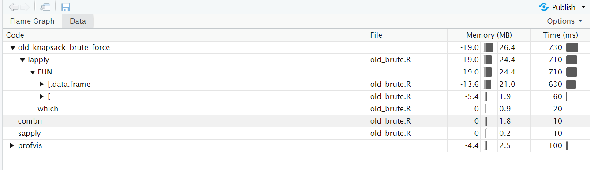
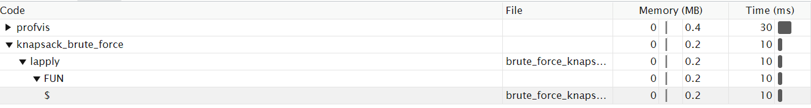
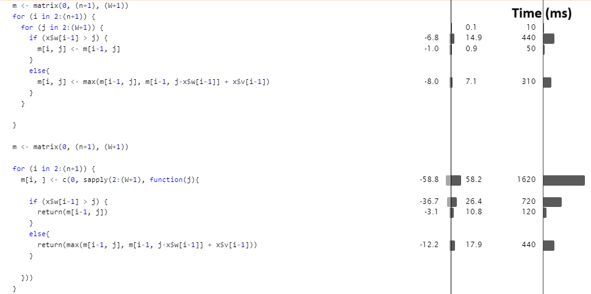

```{r, include = FALSE}
knitr::opts_chunk$set(
  collapse = TRUE,
  comment = "#>"
)
```

The aim of this package is to explore different knapsack algorithms, brute force, dynamic and greedy. All objects have a weight and value and the aim is to maximize the total value that fits in a knapsack of size W.

```{r setup}
# install.packages("devtools")
# devtools::install_github("MaunsOlsson/Lab06", build_vignettes = TRUE)
library(Lab06)

suppressWarnings(RNGversion(min(as.character(getRversion()),"3.5.3"))) 


set.seed(42, kind = "Mersenne-Twister", normal.kind = "Inversion")
n <- 2000
knapsack_objects <- data.frame(w = sample(1:4000, size = n, replace = TRUE),
                               v = runif(n = n, 0, 10000))
```

Brute force search has timecomplexity O($2^n$), the following is runtime with and without parallel computing.
```{r}
start.time <- Sys.time()
knapsack_brute_force(x = knapsack_objects[1:16,], W = 2000, parallel = FALSE)
end.time <- Sys.time()
end.time - start.time

```
The following is the time brute force search takes with parallel computing.
```{r}
# This code cannot be ran in a vignette setting, to see the difference copy the code
# start.time <- Sys.time()
# knapsack_brute_force(x = knapsack_objects[1:16,], W = 2000, parallel = TRUE)
# end.time <- Sys.time()
# end.time - start.time
```


Dynamic programming saves calculations and uses these saved calculations to skip future calculations. The time complexity is O(Wn) where W is the maximum weight of the knapsack. The following shows the runtime for 500 observations.
```{r}
start.time <- Sys.time()
knapsack_dynamic(x = knapsack_objects[1:500,], W = 2000)
end.time <- Sys.time()
end.time - start.time

```

The greedy algorithm sorts the objects by which objects give the most value relative to their weight and tries to include the best ones with no regard for optimum solution. The greedy estimation converges with error $\frac{1}{\sqrt{n}}$ to the optimum. The time complexity is O(nlog(n)), below shows the algorithm with $10^6$ obseravtions.
```{r}

suppressWarnings(RNGversion(min(as.character(getRversion()),"3.5.3"))) 


set.seed(42, kind = "Mersenne-Twister", normal.kind = "Inversion")
n <- 1000000
knapsack_objects <- data.frame(w = sample(1:4000, size = n, replace = TRUE),
                               v = runif(n = n, 0, 10000))

start.time <- Sys.time()
knapsack <- knapsack_greedy(x = knapsack_objects[1:1000000,], W = 2000)
end.time <- Sys.time()
end.time - start.time

```

## Optimization of the algorithms'
For the brute force algorithm our first solution involved true-false vectors while the second one had a bit solution that turned out to be much faster.



For the greedy algorithm we did not see a need to optimize as it ran $n = 10^6$ without problem.



It turned out that for loops were faster than sapply in this situation which was surprising.


